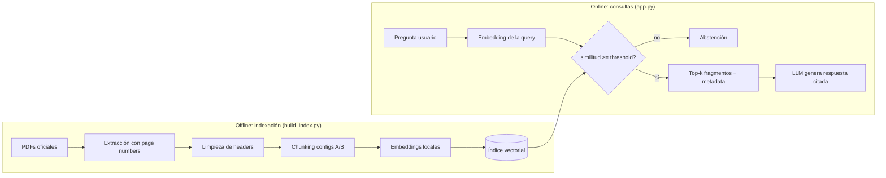
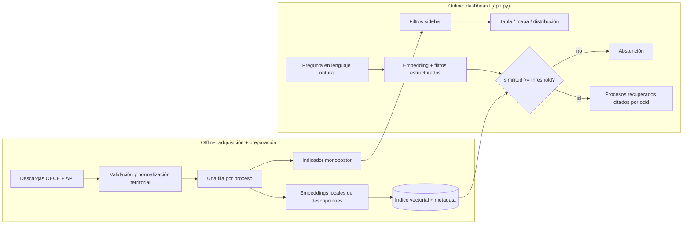

# Pipelines

Diagramas de los pipelines offline/online de ambas tareas. Se completan a medida que se
implementa cada fase; sirven de base para la sección "Pipeline Task 1/2" del video (regla
pipeline-primero).

## Tarea 1 — RAG Normativo

_Pendiente: completar con decisiones reales (threshold calibrado, tamaños de chunk elegidos)
una vez cerradas las Fases 2-3._

## Tarea 2 — RAG Radar

_Pendiente: completar con métricas reales de Recall@k y resultado del indicador de riesgo._
