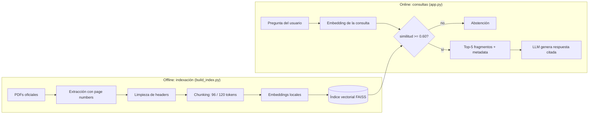
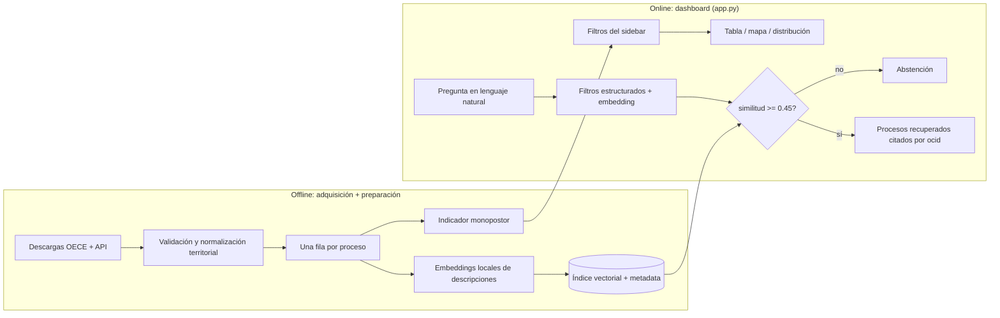

# Pipelines

Diagramas de los flujos offline (indexación/preparación de datos) y online
(consultas) de ambas tareas.

## Tarea 1 — RAG Normativo

Threshold de abstención calibrado en 0.60; configuración de chunking activa
de 120 tokens con overlap de 30 (ver README, sección Tarea 1).

## Tarea 2 — RAG Radar

Threshold de abstención calibrado en 0.45 (ver README, sección Tarea 2, para
la justificación de por qué el threshold de la Tarea 1 no transfiere a esta
escala).
